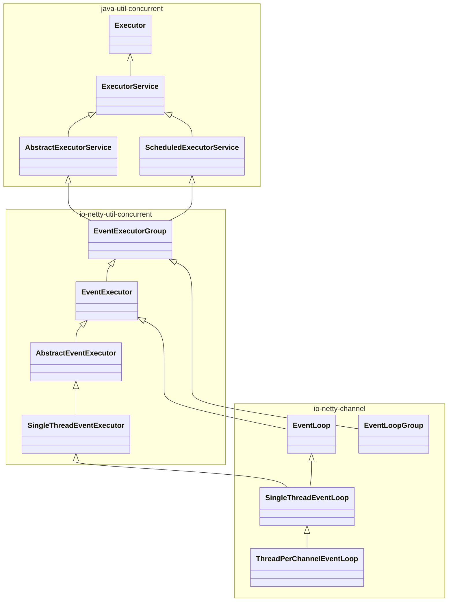
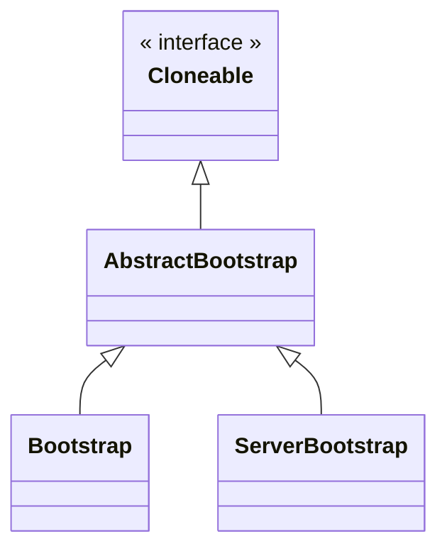

Netty作为一个广泛应用的Java高性能网络框架，不仅可以作为框架使用，其本身的设计模式和思路也很值得学习。
<!--more-->

> 本章绝大多数内容均拷贝自原书，根据Netty、Java版本有一定变动。Netty4.1.101Final。

> Netty 5不建议使用

> 不要单纯地学习使用框架，学习一个框架要学习它的设计思路

## 基本架构
1. Netty的位置：在传输层以上，在应用层以下。负责将传输层的数据处理好，供上层应用业务使用。
2. 架构核心：Netty也是一种反应式架构，参考[反应式宣言](https://www.reactivemanifesto.org/zh-CN)。具体来说，具有
    1. 即时响应性（Responsive）：注于提供快速而一致的响应时间，可靠且已知的反馈上限，一致的服务质量，对于错误也能尽快发现并处理。
    2. 回弹性（Resilient）：系统在出现失败时仍然能保持即时响应性。
    3. 弹性（Elastic）：对负载进行响应，能够自动增加、减少资源来适应。
    4. 消息驱动（Message Driven）：依赖于异步的消息传递，确保松耦合、隔离、边界明确。
    > 消息驱动是手段，回弹性、弹性是形式，即时响应性是最终体现的价值。
2. 基本术语：
   1. Channel：在Netty中代表了到一个通信实体的连接，可以对连接进行打开、关闭，并对活跃连接上进行读写，
   2. 回调：Netty使用回调来处理各类事件，使用回调时，须泛化实现对应接口的事件回调函数
   3. Future：Netty提供了自己的实现```ChannelFuture```，可以通过对其添加监听器```ChannelFutureListener```，作为另一种在事件结束时通知应用程序的方式
   4. 事件和ChannelHandler：Netty提供的事件包括但不限于
        - 连接开关
        - 记录日志
        - 数据转换
        - 流控制
        - 用户事件
        </br>这些事件将会根据其数据发送方向，分别在ChannelHandler中由预设、或用户实现的各种事件处理器进行处理，并支持对事件转发，达到链式处理的效果。
3. 基本原理：
    - Netty基于NIO，整体原理就是由Selector监听I/O事件，并派发给对应的处理线程
    - Netty为每一个Channel创建一个事件循环EventLoop
    - EventLoop在执行期间注册回调，并将事件派发
4. 重点类型：
   1. 各类handler：```SimpleChannelInboundHandler```、```ChannelHanderAdapter```，区别主要在于业务逻辑对消息的处理，以及对资源的处理（是否释放消息所用内存）。如果使用不当，可能会抛出资源无法释放等异常提示。
   2. ```ChannelHandlerContext```：同时持有关联的```Channel```，```Handler```，```Pipeline```。负责在```Handler```链上传递出站入站消息，向对端发送数据等功能。
5. 样板代码：改动自原书，版本基于Netty-all 4.1.101Final
```java
// 回显服务端ChannelHandler
// Sharable说明该Handler可供多个channel共享使用
@ChannelHandler.Sharable
public class MyServerChannelHandler extends ChannelInboundHandlerAdapter {

    // 从通道中读取到数据的回调
    @Override
    public void channelRead(ChannelHandlerContext ctx, Object msg) throws Exception {
        ByteBuf in = (ByteBuf) msg;
        System.out.println("get msg: " + in.toString());
        // ChannelHandlerContext同时关联channel、handler、pipeline
        // 将输入数据回显给对端。这里是写入缓冲，不一定发送
        ctx.write(in);
    }

    // 读取完成回调，此时代表当前批次读取没有更多的数据了（读取长度为0）
    // 对于流式的数据，并不是绝对的正确
    @Override
    public void channelReadComplete(ChannelHandlerContext ctx) throws Exception {
        // 将发送缓冲区刷新
        // writeAndFlush返回一个ChannelFuture。这里在刷新完成后，关闭channel
        ctx.writeAndFlush(Unpooled.EMPTY_BUFFER).addListener(ChannelFutureListener.CLOSE);
    }

    // 异常处理
    // 正常情况下，各个Handler链式处理消息或者异常，因此应当至少有一个exceptionCaught实现
    // 如果一个用户实现的都没有，会在链尾标记为未处理
    @Override
    public void exceptionCaught(ChannelHandlerContext ctx, Throwable cause) throws Exception {
        cause.printStackTrace();
        ctx.close();
    }
}

// 服务器启动代码
public class ServerClass {

    public final int port ;

    public ServerClass(int port) {
        this.port = port;
    }

    public static void main(String args[]) throws Exception {
        int port = 5000;
        new ServerClass(port).start();
    }

    public void start() throws Exception {
        // 自定义的ChannelHandler
        final MyServerChannelHandler serverHandler = new MyServerChannelHandler();
        // 创建核心EventLoopGroup
        EventLoopGroup group = new NioEventLoopGroup();
        try {
            // 创建服务器
            ServerBootstrap b = new ServerBootstrap();
            // 配置EventLoopGroup，这里设置成了分享，实际也可以设置BossGroup和WorkerGroup不同
            b.group(group)
                // 配置Channel类型
                .channel(NioServerSocketChannel.class)
                // 服务器本地地址、端口
                .localAddress(new InetSocketAddress(port))
                // 这里的child指子Channel
                // ChannelInitializer是一种特殊的ChannelHandler
                // 特化了Channel初始化回调
                .childHandler(new ChannelInitializer<SocketChannel>() {
                    @Override
                    public void initChannel(SocketChannel ch)
                            throws Exception {
                        // 设置了Sharable，可以在多个Channel间共享
                        ch.pipeline().addLast(serverHandler);
                    }
                });
            // 阻塞等待服务建立（绑定到端口）
            ChannelFuture f = b.bind().sync();
            // 阻塞等待服务终止
            f.channel().closeFuture().sync();
        } finally {
            // 释放资源，优雅退出
            group.shutdownGracefully().sync();
        }
    }
}


// 客户端Handler
// SimpleChannelInboundHandler接口有调整
@ChannelHandler.Sharable
public class MyClientChannelHandler extends SimpleChannelInboundHandler<ByteBuf> {

    // 通道可用回调，即连接建立
    @Override
    public void channelActive(ChannelHandlerContext ctx) throws Exception {
        ctx.writeAndFlush(Unpooled.copiedBuffer("Netty rocks!", StandardCharsets.UTF_8));
    }

    // 若实现channelRead
    @Override
    protected void channelRead0(ChannelHandlerContext channelHandlerContext, ByteBuf byteBuf) throws Exception {
        System.out.println(
                "Client  channelRead received: " + (((ByteBuf)byteBuf).toString(CharsetUtil.UTF_8)));
    }


    @Override
    public void exceptionCaught(ChannelHandlerContext ctx, Throwable cause) throws Exception {
        cause.printStackTrace();
        ctx.close();
    }
}


// 客户端启动类
public class PeerClass {
    private final String host;
    private final int port;

    public PeerClass(String host, int port) {
        this.host = host;
        this.port = port;
    }

    public void start() throws Exception {
        EventLoopGroup group = new NioEventLoopGroup();
        try {
            // 普通启动类
            Bootstrap b = new Bootstrap();
            b.group(group)
                    .channel(NioSocketChannel.class)
                    // 配置远程地址
                    .remoteAddress(new InetSocketAddress(host, port))
                    // 配置初始化ChannelHandler
                    .handler(new ChannelInitializer<SocketChannel>() {
                        @Override
                        public void initChannel(SocketChannel ch)
                                throws Exception {
                            ch.pipeline().addLast(
                                    new MyClientChannelHandler());
                        }
                    });
            // 阻塞等待连接建立
            ChannelFuture f = b.connect().sync();
            // 阻塞等待连接关闭
            f.channel().closeFuture().sync();
        } finally {
            group.shutdownGracefully().sync();
        }
    }
    public static void main(String[] args) throws Exception {
        new PeerClass("localhost", 5000).start();
    }
}

```
## 组件设计速览
1. 先思考：做一个高性能的IO框架都需要什么
   1. 数据结构：表达不同类型的连接、表达不同的异步事件
   2. 接口：统一的消息处理接口、统一的异常处理、统一的编解码
   3. 流程：允许消息在不同的处理器之间流转
   4. 事件处理：能处理异步事件、也能兼容同步阻塞业务
   5. 通用功能：日志、多线程
### Channel系
1. ```Channel```：对不同类型连接的抽象
   1. 内置类型：NIO（NioSocketChannel/NioDatagramChannel）、OIO（阻塞流）、Local（一个JVM内）、Epoll（Linux下推荐）、Embedded（一种特殊的用于嵌入其他ChannelHandler中的Channel）
   2. 关联：Pipeline。当Channel创建时，自动就创建了Pipeline，用来容纳各种消息处理器。
   3. **线程安全**
2. ```ChannelHandler```：核心接口，业务核心一般就在相应的回调函数的实现中
   1. 核心子接口：
        - 入站：```ChannelInboundHandler```
        - 出站：```ChannelOutBoundHandler```
   2. 实用类型
      1. ```ChannelInboundHandlerAdapter```：较为原始的入站处理器，自定义继承后，仍需要显式手动释放消息缓存
      2. ```SimpleChannelInboundHandler```：会自动释放消息缓存，自定义继承后只需要执行业务逻辑
   3. Handler实现的功能包括但不限于：
      1. 数据格式转换
      2. 异常通知
      3. Channel活跃状态变化通知
      4. 用户自定义事件
      5. Channel到EventLoop是注册、注销通知
   4. 性能要求：不能在处理过程中使用同步阻塞接口（比如各类```ChannelFuture```的```sync```）。这是因为一个Channel只允许注册到一个EventLoop，因此EventLoop是一定要尽量不会阻塞的。对于这类需求，```ChannelPipeline.add```的重载中有提供EventLoopGroup的版本，可以传递一个自定义EventLoopGroup，在消息传递时，该Handler的事件将会由对应的事件循环负责。
3. ```ChannelHandlerAdapter```：对Channelhandler的一个基本实现
   1. 意义：由于消息的链式传输需要每一个Handler都向后传递消息，即使是用户不关心的事件，也要写一个样板代码```firexxxx(msg)```，这很无聊
   2. 作用：提供了默认的透传实现，用户只需在适配器Adapter的基础上，选择自己感兴趣的接口进行自定义继承即可。
4. ChannelPipeline：作为Channelhandler链的容器
   1. 关联：Channel在创建后会分配到一个ChannelPipeline，二者相互绑定，且在生命周期内都是永久的。
   2. 作用：
      1. 通过```add / remove / replace```，允许运行时修改处理器链
      2. 通过各类```firexxx```，发出一个入站消息，并从**链首**的处理器开始处理（小心造成死循环）
      3. 通过调用```read / write / bind / connect / disconnect / close / dereigster / flush / writeAndFlush```，来发出一个出站操作，该操作将会继续沿着当前调用链的顺序向下执行
        > 注意，对于在同一个```ChannelHandlerContext```内的对象实例，通过```channel().write```，和```pipeline().write```的调用最终结果是一样的，都由是由绑定的```pipeline()```进行处理
   3. 处理器链的顺序：[参考官网文档](https://netty.io/4.1/api/index.html)，入站口始终是链表首部、出站口始终是链表尾部，也就是说一个入站消息事件，会从链表首部开始向后传递，而一个出站消息事件，将从链表尾部开始向前传递。在传递过程中，不支持的处理器将会直接透传（如各个```Adapter```的实现），或者由```ChannelPipeline```操作进行跳过。
5. ChannelHandlerContext：当Handler添加到Pipeline中时，分配获得
   1. 意义：代表handler和ChannelPipeline之间的绑定关系。多用于写出站数据，该数据将从出站的尾端开始流动。
   2. 关联：每一个Handler被加入Pipeline时，都会为其创建一个唯一，与之绑定的ChannelHandlerContext
   2. 作用：
       1. 所有和```ChannelPipeline```相同接口，均可使用，并且具有更短的调用链。即对于出站事件（如```write```），将会沿出站方向（链尾到链首），由下一个```ChannelOutBoundHandler```处理。对于入站事件，从入站顺序下一个开始处理。
            
       2. ChannelHandlerContext和Handler的绑定关系是唯一的，不可更改的。但Pipeline则允许修改，替换，重新编排。因此可以在Handler中保存Context，以在其他场景下使用。
   
   > 无论是Context还是Pipeline，当传递出站消息，执行出站操作时，请一定想清楚你要做什么。
6. ChannelConfig：支持热更新的配置
7. ChannelFuture：Channel相关的Future
   1. 子类：
      1. ChannelPromise：在写入通道等动作中用于标记执行成功与否

### 数据系
1. 设计思考：网络传输的最小单位基本就是字节，而Java提供的ByteBuffer过于底层，接口复杂，对于网络通信来说不够方便。对缓冲区的设计应当考虑：
   1. 性能：提高拷贝、移动效率、池化、控制GC
   2. 容量：支持动态变化
   3. 访问：随机访问、顺序访问、能支持查找
   4. 线程安全
   5. 防内存泄露
2. ```ByteBuf```：Netty的字节缓冲区组件
   1. 特点：
      1. 支持缓冲区类型扩展
      2. 零拷贝支持
      3. 容量按需增长
      4. 读取、写入双索引（读写不需要切换，不需要做原生Buffer的flip操作）
      5. 支持链式调用、引用计数、池化
   2. 缓冲区模式：
      1. 堆缓冲区：创建并使用分配到堆中的数组，又称支撑数组。```ByteBuf.array()```，可以通过```hasArray```来判断当前```Bytebuf```是否使用支撑数组。
      2. 直接缓冲区：直接使用外部分配的内存（Native分配，不在JVM的内存管理范围内），因为减少了从Native内存拷贝到JVM堆的过程，往往能提升性能。```ByteBuf.getBytes```
      3. 复合缓冲区```CompositeByteBuf```：可由多个```ByteBuf```聚合而成。这在一些需要拼接数据内容的协议中十分实用，不同的```ByteBuf```往往由多个模块负责填充。最终聚合到一起，减少不必要的拷贝。示例代码
        ```java
        // 通过Unpooled创建非池化缓冲区
        CompositeByteBuf messageBuf = Unpooled.compositeBuffer();
        ByteBuf headerBuf = ...; // 可以是堆缓冲，也可以是直接缓冲
        ByteBuf bodyBuf = ...;
        // 将已有Buf合并为复合缓冲区
        messageBuf.addComponents(headerBuf, bodyBuf);
        // 业务操作
        // ...
        // 支持对Buf再分离
        messageBuf.removeComponent(0);
        for (ByteBuf buf : messageBuf) {
            System.out.println(buf.toString());
        }
        // 或者通过直接缓冲区的访问方式访问
        int length = messageBuf.readableBytes();
        byte[] array = new byte[length];
        messageBuf.getBytes(messageBuf.readerIndex(), array);
        // 继续使用array
        // ...
        ```
    3. 其他功能
       1. 字节级读写：其中```get/set```不会调整读写索引，```read/write```会调整索引
       2. 派生缓冲区：通过```slice```、```duplicate```等方式建立一个视图，和原缓冲区共享同一个数据源，浅拷贝
       3. 复制：通过```ByteBuf.copy```、```Unpooled.copiedBuffer```，拷贝一个完全独立的新缓冲区，深拷贝
       4. 为了支持池化，提高GC性能，提供引用计数```refCnt```。
            > 需要考虑检测缓冲区泄露
3. ```ByteBufHold```：一个用于保管ByteBuf的接口类型。
   1. 作用：实现，并可以在其中保存其他属性字段，也用于支持池化等高级特性。
4. ```ByteBufAllocator```接口：分配器，分配```ByteBuf```，也是实现ByteBuf池化的接口
   1. 内置实现：```PooledByteByfAllocator```、```UnpooledByteBufAllocator```，顾名思义，前者池化，后者不池化。其中后者还提供了```Unpooled```静态工具类
   2. 和```Channel```关系
      1. 受ChannelConfig控制，也可以在启动服务器、客户端时修改分配器
      2. 可以从```ChannelHandlerContext.alloc()```获取到分配器实例
5. ```ByteBufUtil```：静态工具类
    - ```hexdump()```方法

### 事件循环
3. ```EventLoop```：
   1. 关联：```Channel```、```EventLoop```、```Thread```、```EventLoopGroup```
   2. 关联关系：
        - 一个Group包含多个Loop
        - 一个Loop在生命周期内只绑定一个Thread
        - 一个Channel在生命周期内只注册到一个Loop
        - 一个Loop可以拥有多个Channel

### 工具类
1. ```ReferenceCountUtil```：显式处理消息缓存的引用计数的工具，其内自带有类型检查。```retain```用于保持计数防止回收，```release```用于尝试自动释放。
2. ```AttribyteKey<>```：用于创建属性集的键，主要用两个静态方法```newInstance```、```valueOf```。


## 核心架构
在了解了组件设计之后，本章节将会讲述一些核心架构的内容，包括一些类型的详解，也包括一些惯用技巧。

### Channel和Handler
Channel的生命周期，按如下顺序
- ChannelUnregistered：未注册状态，指未注册到一个```EventLoop```
- ChannelRegistered
- ChannelActive：未激活状态，指未连接到远程节点
- ChannelInactive

ChannelHandler的生命周期，除了处理出站入站数据，还有
- handlerAdded：当handler添加到Pipeline中
- handlerRemoved：移除
- exceptionCaught：处理过程中产生错误时
- 更进一步的，对于具体的通信功能实现，还有更多特别的和生命周期相关的方法
    1. ```ChannelInboundHandler```的部分方法
       - channelUnregistered / channelRegistered：当所在channel已经取消/注册到EventLoop
       - channelActive / channelInactive：所在channel连接成功/不再连接
       - channelReadComplete：上一轮读操作完成
       - channelRead
       - channelWritabilityChanged：代表可写性变化，受制于缓冲区，有时允许或不能再写入更多
       - userEventTriggered：用户自定义事件回调，其调用来源是```fireUserEventTriggered```
    2. ```ChannelOutboundHandler```的部分生命周期方法
       - bind / connect：当请求绑定到本地、远程地址时的回调（绑定和连接是一种出站事件）
       - disconnect：当准备断开时的回调
       - close：请求关闭Channel时回调
       - deregister：请求从Pipeline中注销时回调
       - read：请求从Channel中读取更多数据时的回调，根据需要选择是否调用```read```以传递给下一个。
       - write / flush：写入数据
        > 关于OutBoundHandler中的read，参考[netty碎碎念](https://www.cnblogs.com/FlyAway2013/p/14952753.html)，简而言之，read方法将会触发新一轮的入站事件，如果不在read中向前传播，那么新的数据就不会读取。出站入站事件中的数据都需要按照pipeline进行一轮一轮的处理，因此需要进行控制。
        
        > 将read和ChannelConfig.setAutoRead进行配合，可以实现反应式系统的回压（back-pressure）特性，就是说，当处理不过来的时候，就不要再读取更多的输入了，并且要反馈给数据流的上层。
            
Handler的```@Shareable```注解，标记了这个Handler类型的实例允许绑定到多个Pipeline，因此运行时一个Handler也会面对多个Context（函数参数）。此时这些Handler将有可能在不同的线程中被调用，必须保证线程安全性。共享Handler非常使用，可以跨Channel收集一些信息。

异常处理：
1. 入站事件只需要啊重写exceptionCaught函数即可
2. 出站事件相对复杂
   1. 对于具有ChannelFuture、ChannelPromise返回值或参数的方法，可以通过对返回值、参数设置相应的回调、状态值来处理异常情况
   2. 如果出站事件抛出异常，监听ChannelFuture、ChannelPromise事件的位置也会收到通知

Netty还额外提供了一种特殊的Channel，EmbeddedChannel，这种通道是专门用于对已有的ChannelHandler、ChannelPipeline进行**单元测试**的。本质上就是在单元测试的层面上去模拟一个远程的通信接口。他有五个主要的接口。
| 函数名 | 函数作用 |
| --- | --- |
| writeOutBound | 向ChannelPipeline写入一个出站事件，将会完整流经各个OutBoundHandler |
| readOutBound | 读取ChannelPipeline最终的出站数据 |
| writeInBound | 向ChannelPipeline写入一个入站事件，将会完整的流经各个InBoundHandler |
| readInBound | 读取ChannelPipeline最终的入站结果 |
| finish | 关闭通道，处理/取消剩余任务，并返回是否有可处理的出站、入站数据 |

下面是原书展示的一个入站消息基本测试用法示例
```java
// 一个解码器（Handler处理器的一种）
public class FixedLengthFrameDecoder extends ByteToMessageDecoder {
    private final int frameLength;

    public FixedLengthFrameDecoder(int frameLength) {
        if (frameLength <= 0) {
            throw new IllegalArgumentException(
                    "frameLength must be a positive integer: " + frameLength);
        }
        this.frameLength = frameLength;
    }

    @Override
    protected void decode(ChannelHandlerContext ctx, ByteBuf in,
                          List<Object> out) throws Exception {
        // 只有在缓冲区可用长度超过指定长度后才进行一次读取
        while (in.readableBytes() >= frameLength) {
            ByteBuf buf = in.readBytes(frameLength);
            out.add(buf);
        }
    }
}

// 在单元测试文件中
class FixedLengthFrameDecoderTest {
    @Test
    public void testFramesDecoded() {
        ByteBuf buf = Unpooled.buffer();
        for (int i = 0; i < 9; i++) {
            buf.writeByte(i);
        }
        ByteBuf input = buf.duplicate();
        // 测试一个以满足固定数据长度为处理要求的解码器。
        EmbeddedChannel channel = new EmbeddedChannel(
                new FixedLengthFrameDecoder(3));

// write bytes
        assertTrue(channel.writeInbound(input.retain()));
        assertTrue(channel.finish());
// read messages
        ByteBuf read = (ByteBuf) channel.readInbound();
        assertEquals(buf.readSlice(3), read);
        read.release();
        read = (ByteBuf) channel.readInbound();
        assertEquals(buf.readSlice(3), read);
        read.release();
        read = (ByteBuf) channel.readInbound();
        assertEquals(buf.readSlice(3), read);
        read.release();
        assertNull(channel.readInbound());
        buf.release();
    }
}
```


### 线程模型
当我们已经有了针对网络通信事件的处理组件和基本流程之后，现在的问题是如何通过线程运行，来组织这些事件的处理。而且要满足：稳定、高效、可扩展。

这些任务就落在了对线程模型的设计上。即如何在线程内将各类I/O事件编排成具体可处理的任务，发放给各个所属的线程执行，如何保证线程安全。



如上图所示。Netty的线程模型EventLoop是在Java的concurrent包内的Executor的基础上继承发展而来。EventLoop扩展了ExcheduledExecutorService的各种方法。在实际运行时，Channel可以通过相同的API，给绑定的EventLoop直接提交任务，例如：
```java
Channel ch;
// 60s后调度一次
ScheduledFuture<?> future = ch.eventLoop().schedule(
    new Runnable() {
        @Override
        public void run() {
        System.out.println("60 seconds later");
        }
    }, 60, TimeUnit.SECONDS);
// 甚至可以取消
future.cancel(true);
```

目前在Netty4中，有以下几点值得注意：
1. 所有的入站事件、出站事件，都统一由所绑定的EventLoop处理
2. 由EventLoop所在线程提交的任务，将会被立刻执行。这种判断由Netty利用```inEventLoop()```自动完成。
3. 对于非EventLoop所在线程的其他线程所提交的任务，将会排队调度，稍后执行。这个特性让用户扩展ChannelHandler的方法时，仍然可以不考虑同步问题。因为最终都需要被EventLoop执行调度。
4. 鉴于前面两点，再次重申，在Handler中不要将任何过于耗时的任务放到EventLoop中执行。对于过于耗时的任务，应当建立单独的EventExecutor进行处理。在创建Handler时就应当考虑传递一个EventExecutorGroup。
    ```java
    EventExecutorGroup myExec = new DefaultEventExecutorGroup(2);
    MyServerChannelHandler serverHandler = new MyServerChannelHandler();
    // 在启动代码的ChannelInit中
    ch.pipeline().addLast(myExec,serverHandler);
    
    // 在handler中使用ChannelHandlerContext
    // 或者其他executor接口，如schedule、execute等
    ctx.executor().submit(new Runnable {/*...*/});
    ```
    > **注意区分**EventExecutor和inEventLoop的作用。前者是把耗时任务提交给其他线程。后者是测试当前代码是否是EventLoop线程执行的。上文中的  ```ctx.executor().submit```  仍然有可能由非EventLoop线程调用。
5. 事件处理遵循先入先出原则，以保证消息处理顺序正确

虽然设计上倾向于使用异步模型的通信方式。但即使是必须使用OIO阻塞模型的通信接口，也可以通过限制一个EventLoop内只绑定一个Channel，同时添加事件超时时间来完成兼容。

### 引导
> Bootstrap，一个在多种场合下都能看见的词汇，它的原意是用于提鞋的带子。对应了系统启动，引导期间的窘状。

引导的一个定义是：对应用程序进行配置，使它运行起来的过程。在Netty中，这个过程在服务器和客户端两侧有不同的含义。对于服务器端，代表了启动一个父Channel并接收来自客户的连接，为其创建子Channel的过程。对于客户端，则是创建一个Channel用于连接服务器的过程。


通用的引导过程由AbstractBootstrap负责，Bootstrap内是专供客户端的，Server则是专供服务器端的。这里展开一下AbstractBootstrap的详细定义
```java
public abstract class AbstractBootstrap
    <B extends AbstractBootstrap<B,C>,C extends Channel>

// 而子类的定义是
public class Bootstrap
    extends AbstractBootstrap<Bootstrap,Channel>
```
在阅读Netty代码时，经常有类似的定义方式。非常令人困惑。总的来说，这里的泛型参数的条件是，当前类的一个子类。而这样做的目的是为了支持在一个继承体系内，子类和父类均能使用链式调用（即```A.setA().setB().setC()```），相关内容参考[Java链式调用的继承：泛型](https://blog.csdn.net/fyyyr/article/details/112302821)

下面先讲解一下客户端的引导方式。客户端```Bootstrap```其实不仅用于客户端，也用于无连接协议（这种类型协议没有服务器和客户端的区分）。具体来说，此类引导类需要做的事情包括
| 函数名 | 函数描述 |
| --- | --- |
| group | 设置EventLoopGroup |
| channel | 设置将要使用的Channel类 |
| localAddress | 设置本地地址、端口，没有就随机 |
| bind | 尝试绑定Channel，也可设置新的localAddress |
| option | 设置ChannelOption，缓冲区，保活机制等，只对新创建的Channel有效 |
| attr | 设置Channel属性值，用户自定义的扩展数据，只对新创建的Channel有效 |
| handler | 设置处理器 |
| clone | 为了便于创建类似配置的Channel，允许浅拷贝当前引导类 |
| remoteAddress | 设置远程连接地址 |
| connect | 尝试连接远程，也可设置新的remoteAddress |

需要注意的是，虽然Netty同时支持NIO、OIO，即异步和同步两种风格的通信模型。但是不能将两种组件混用。在引导类的配置中，NIOEventLoopGroup不能用于OIOSocketChannel。这是很显然的，因为不同的通信模型，他们对待EventLoop、Channel的方式，和两者的映射关系等都不一样。

引导服务器端要相对复杂一些。```Bootstrap```有的方法，```ServerBootStrap```基本都有，但语义有所不同，上面的各个函数在```ServerBootStrap```中指的都是```ServerChannel```。也就是相当于接收连接的部分，而连接成功之后，会将对应连接的远程通信创建成一个子Channel。此时额外有一些函数供其使用，包括
| 函数名 | 函数描述 |
| --- | --- |
| childOption | 子Channel配置 |
| childAttr | 子Channel属性 |
| childHandler | 子Channel所用的处理器 |

这里还要强调一下，所谓```ServerChannel```的Handler到底在处理什么呢。实际上如果你写一下测试代码就会发现。ServerChannel的Handler中的msg，实际上就是将要创建的子Channel。那么在实际的开发中，可以用这一步对连接的细节做一些检查处理。
```java
@ChannelHandler.Sharable
public class MyServerChannelHandler extends ChannelInboundHandlerAdapter {
    @Override
    public void channelRead(ChannelHandlerContext ctx, Object msg) throws Exception {
        // 和前面一样，都需要传递给后续处理
        ctx.fireChannelRead(msg);
        if(msg instanceof NioSocketChannel){
            System.out.println("here is server channel read");
            return;
        } else {
            System.out.println("here is child channel read");
        }
    }
}
```

而在实际应用中，也会遇到二者的结合。比如一个代理服务器，它将接收客户端请求，并作为客户端再向上游服务器请求数据。此时可以根据性能的需要。选择这个请求所涉及的两个Channel是用同一个EventLoopGroup（一般来说更推荐），还是创建新的EventLoopGroup。无论怎么做，一定要清楚一点，位于同一个线程中的Channel业务处理将会更快（直接调用），如果一个消息的处理跨线程（或者说是跨EventLoop），将会保存到调度任务中，并稍后再执行。

关闭引导类，释放资源，本质上就是在关闭EventLoopGroup，因此只需要操作对应的事件循环组关闭退出即可，引导类本身并不需要进行特别的处理。
```java
group.shutdownGracefully();
```

## 编解码器
通过上一章节的讲述，```Channel```、```EventLoop```、```Bootstrap```，这三类组件，我们已经了解了Netty是如何完成I/O框架的组织。接下来，本章节将会专门讲述从传输层到应用层的关键组件：编解码器。编解码器实际上仍然在为ChannelPipeline中的Handler服务，所以也不难想象到，起始编解码器本身也是Handler的一种。

### 解码器
解码器一共有两个大类：
- 将字节数据转换为指定类型的消息：```ByteToMessageDecoder```，```ReplayingDecoder```。二者的区别主要在于是否需要自己判断读取的字节数足够转型为一个目标类型，前者不能，会直接异常。而后者会在内部抛出异常，自动停止转换，并等待更多的字节数再尝试。
- 将指定类型的消息转换为另一种类型的消息：```MessageToMessageDecoder```

抽象类```ByteToMessageDecoder```，核心函数是```decode```，```decodeLast```（当通道不再活跃时被调用）。正如上面所说，这个抽象类的问题在于，必须自己考虑缓冲区中的字节数是否满足类型转换需求。比如
```java
public class ToIntegerDecoder extends ByteToMessageDecoder {
@Override
public void decode(ChannelHandlerContext ctx, ByteBuf in,
                    List<Object> out) throws Exception {
        // 判断是否满足int需求
        if (in.readableBytes() >= 4) {
            out.add(in.readInt());
        }
    }
}
```

抽象类```ReplayingDecoder```，则提供了一个改造了的```ReplayingDecoderByteBuf```，它包装了传入的缓冲区，当长度不足时，会抛出一个```Signal```，```Decoder```会捕获该信号异常，循环读取直到长度满足要求（核心逻辑可见```callDecode```函数），阅读该函数可知对解码器的要求是，要么每次调用获得新的解码输出，要么变更解码状态（发异常信号）。和前面的解码器相比整体性能较差，但是更容易编写。此时用户的写法是，
```java
public class ToIntegerDecoder2 extends ReplayingDecoder<Void> {
    @Override
    public void decode(ChannelHandlerContext ctx, ByteBuf in,
                        List<Object> out) throws Exception {
        // 由基类自动检查
        out.add(in.readInt());
    }
}
```

抽象泛型类```MessageToMessageDecoder<>```，该类型的用法是用原始类型作为泛型类型参数，并在解码器中将其转换为自己想要的新类型，例如
```java
public class IntegerToStringDecoder extends
    MessageToMessageDecoder<Integer> {

    @Override
    public void decode(ChannelHandlerContext ctx, Integer msg
        List<Object> out) throws Exception {
        // 转换成String放到输出里
        out.add(String.valueOf(msg));
    }
}
```

另外在解码器阶段，需要考虑缓冲过长问题。如果我们收到了一个过于长的数据，确实有可能导致缓冲区耗尽内存。作为一个负责任的框架，Netty提供了一个异常来专门描述这个情况：```TooLongFrameException```。当你发现缓冲区剩余字节过多的时候，可以考虑抛弃所有字节，形如
```java
int readable = in.readableBytes();
if (readable > MAX_FRAME_SIZE) {
    in.skipBytes(readable);
    throw new TooLongFrameException("Frame too big!");
}
```

### 编码器
编码器用于实现对出战消息的处理，和解码器类似，也提供了从消息到字节```MessageToByteEncoder```，和从消息到消息```MessageToMessageEncoder```。共两种大类的编码器。分别提供两种抽象函数供继承
```java
// MessageToByteEncoder<InputDataType>
encode(ChannelHandlerContext ctx, InputDataType msg, ByteBuf out);

// MessageToMessageEncoder<InputDataType>
encode(ChannelHandlerContext ctx, InputDataType msg, List<Object> out);
```

### 编解码器
在ChannelHandler章节，可能会有一个疑问，为什么会有处理器同事是入站处理器和出站处理器。本节就是这种类型处理器的最常见应用：编解码器。有些时候，在同一个类型中完成入站和出战消息的编解码是更方便的。它们同时具有上述解码器、编码器的抽象函数。

比较特别的是对于消息类型，其抽象类定义如下
```java
public abstract class MessageToMessageCodec<INBOUND_IN, OUTBOUND_IN> 
    extends ChannelDuplexHandler {
    
    // 将OUTBOUND_IN消息类型，转换为INBOUND_IN
    protected abstract void encode(ChannelHandlerContext var1
            , OUTBOUND_IN var2, List<Object> var3) throws Exception;

    // 将INBOUND_IN消息类型，转换为OUTBOUND_IN
    protected abstract void decode(ChannelHandlerContext var1
            , INBOUND_IN var2, List<Object> var3) throws Exception;
}
```

考虑到在一个类中实现编解码器，会对设计模式产生一定的负面影响，影响可复用性。显然也还有一种更优雅的形式：分别编写入站和出站的基本逻辑，再将处理器组合（而不是继承后写在一起）
```java
public class CombinedChannelDuplexHandler<I extends ChannelInboundHandler, O extends ChannelOutboundHandler>
    extends ChannelDuplexHandler {
    // 内部分别保存入站和出站处理
    private I inboundHandler;
    private O outboundHandler;
}
```

## 网络协议
Netty已经内置了对大量网络协议的Channel、ChannelHandler支持，下表中列出一些对应的代表。

| 类名称 | 类别 | 作用 |
| --- | --- | --- |
| SslChannelInitializer | ChannelInitializer | 基于Channel进一步初始化一个Ssl通信信道 |
| SslHandler | ChannelHandler | 进行Ssl协议握手，对数据加解密 |

## 案例分析

## 参考资料
1. 《Netty In Action》
2. [Netty官网](https://netty.io/)
3. [Netty官网中的手册部分-4.1版](https://netty.io/4.1/api/index.html)